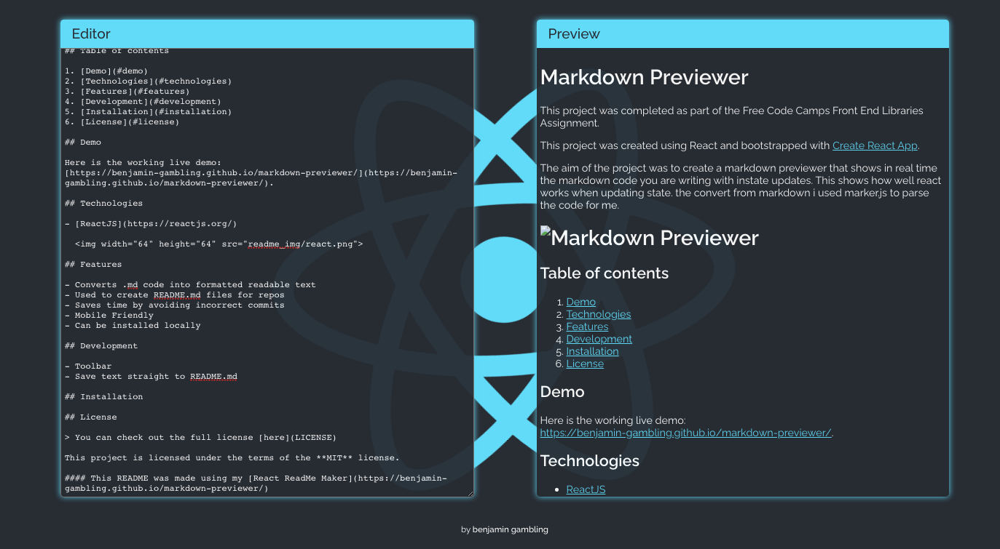

# Markdown Previewer

This project was completed as part of the Free Code Camps Front End Libraries Assignment.

This project was created using React and bootstrapped with [Create React App](https://github.com/facebook/create-react-app).

The aim of the project was to create a markdown previewer that shows in real time the markdown code you are writing with instate updates. This shows how well react works when updating state. the convert from markdown i used marker.js to parse the code for me.

# 

## Table of contents

1. [Demo](#demo)
2. [Technologies](#technologies)
3. [Features](#features)
4. [Development](#development)
5. [Installation](#installation)
6. [License](#license)

## Demo

Here is the working live demo:
[https://benjamin-gambling.github.io/markdown-previewer/](https://benjamin-gambling.github.io/markdown-previewer/).

## Technologies

- [ReactJS](https://reactjs.org/)

  

## Features

- Converts .md code into formatted readable text
- Used to create README.md files for repos
- Saves time by avoiding incorrect commits
- Mobile Friendly
- Can be installed locally

## Development

- Toolbar
- Save text straight to README.md

## Installation

1. Download locally to desktop
   `npm install @benjamin-gambling/markdown-previewer`

2. Naviagte to Directory  
   `cd path/to/file`

3. Lauch App Locally  
   `npm start`

## License

> You can check out the full license [here](LICENSE)

This project is licensed under the terms of the **MIT** license.

#### This README was made using my [React ReadMe Maker](https://benjamin-gambling.github.io/markdown-previewer/)
